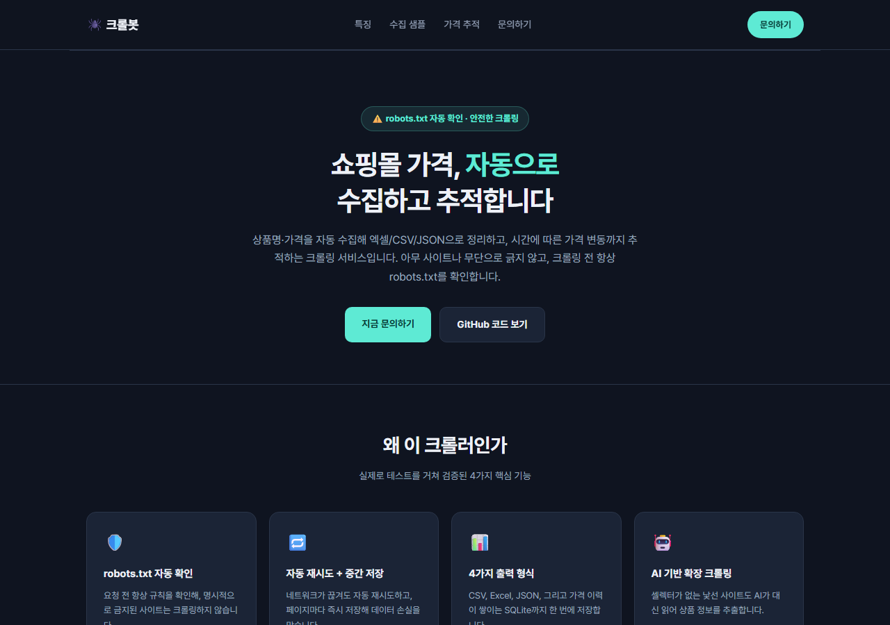
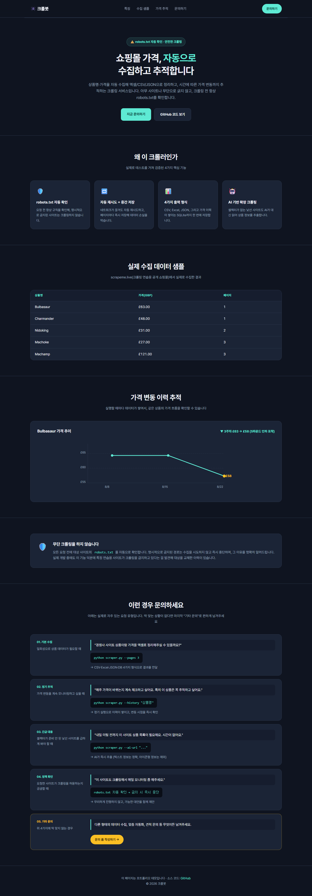
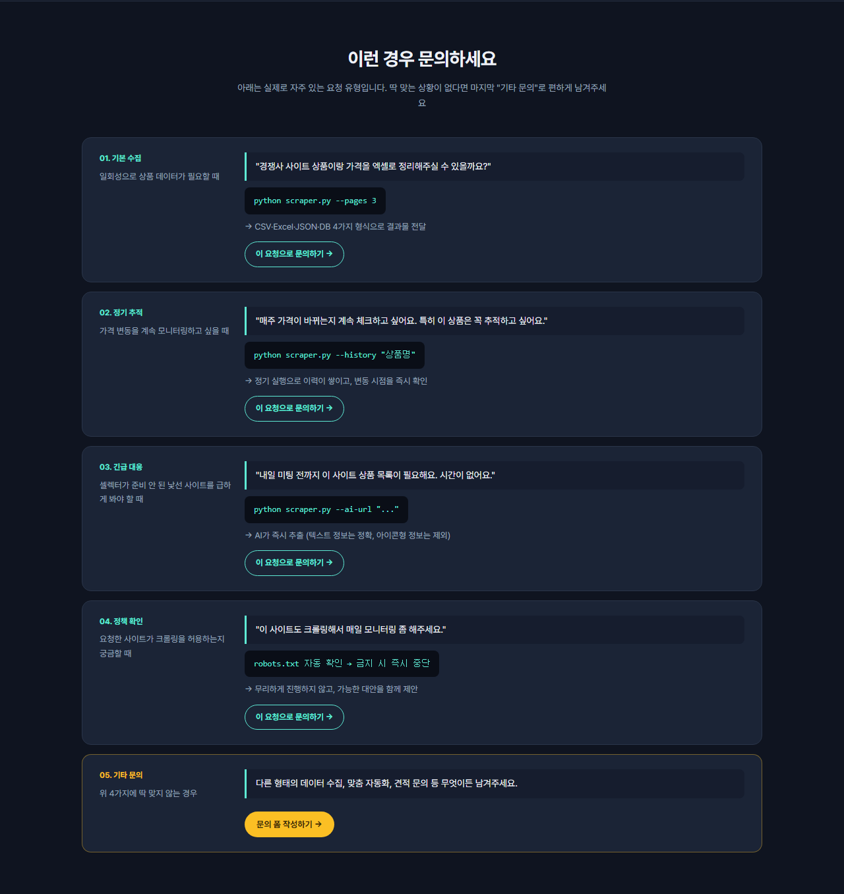
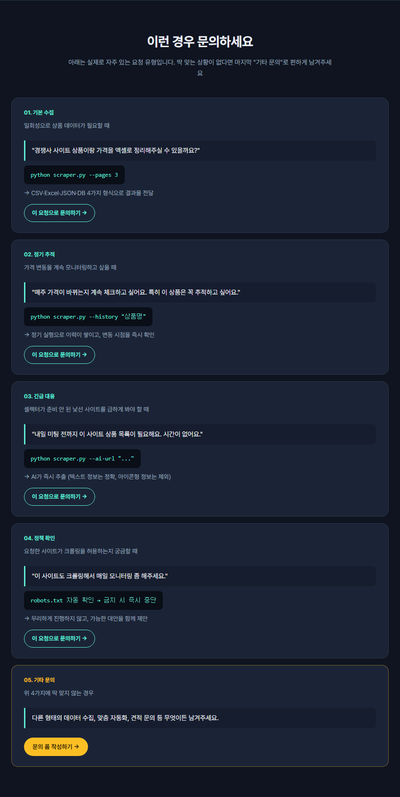

# 웹 크롤러 — 쇼핑몰 상품/가격 자동 수집 (robots.txt 자동 확인)

쇼핑몰에서 상품명과 가격을 자동으로 긁어와 CSV/Excel로 정리해주는 크롤러
샘플. 크롤링 전 대상 사이트의 robots.txt를 코드가 자동으로 확인해 허용된
범위에서만 동작한다. 크몽·숨고에 "데이터 수집/가격 비교 자동화" 카테고리로
올릴 때 쓰기 좋은 포트폴리오다.

🔗 **소개 페이지(라이브 데모)**: https://dyj02056.github.io/web-crawler-books/
(GitHub Pages 활성화 필요 — 아래 "소개 페이지 배포" 참고)

처음 보는 사람도 이해할 수 있는 상세 설명은 [`설명서.md`](./설명서.md) 참고.

## 특징
- `requests` + `BeautifulSoup`로 정적 웹페이지를 읽어 필요한 정보만 추출
- **요청 전 robots.txt를 자동으로 확인**해 명시적으로 금지된 경로는 크롤링하지 않음
- 페이지 단위로 상품명, 가격을 수집
- **일시적인 네트워크 오류 발생 시 자동 재시도**(최대 3회, 점점 길게 대기)
- **페이지마다 CSV에 즉시 이어서 저장** — 중간에 프로그램이 중단돼도 그때까지 모은 데이터는 안전하게 남음
- 수집한 데이터를 **CSV / Excel / JSON** 세 가지 형식으로 동시 저장
- **SQLite로 가격 이력을 계속 누적** — 실행할 때마다 지우지 않고 쌓여서, 같은 상품의 가격이 시간에 따라 어떻게 바뀌었는지 나중에 조회 가능 (`--history` 옵션)
- 수집할 페이지 수, 저장 경로를 명령줄 옵션으로 조절 가능

## 실행 방법
```bash
pip install requests beautifulsoup4 xlsxwriter
python scraper.py
```
실행하면 `output_products.csv`, `output_products.xlsx`, `output_products.json`,
`price_history.db` 네 파일이 생성된다. 페이지 수를 조절하고 싶으면:
```bash
python scraper.py --pages 5
```

## 가격 변동 이력 조회
크롤링 결과는 `price_history.db`(SQLite)에 실행할 때마다 계속 누적된다.
아래처럼 특정 상품의 과거 가격 흐름을 바로 조회할 수 있다.
```bash
python scraper.py --history "Bulbasaur"
```

## AI 기반 추출 (셀렉터가 없는 낯선 사이트용)
미리 셀렉터를 만들어두지 않은 사이트도, `--ai-url`로 AI(Gemini)에게
페이지를 보여주고 상품 정보를 대신 뽑아달라고 요청할 수 있다. 이 모드도
동일하게 요청 전 robots.txt를 자동으로 확인한다.

```bash
pip install google-genai python-dotenv
```
1. [aistudio.google.com](https://aistudio.google.com)에서 구글 계정으로 로그인해 무료 API 키 발급
2. `.env.example`을 복사해 `.env`로 저장하고 발급받은 키를 `GOOGLE_API_KEY`에 붙여넣기
3. 실행
   ```bash
   python scraper.py --ai-url "https://대상사이트.com/상품목록"
   ```

⚠️ **한계**: AI 방식은 화면에 "보이는 글자"만 읽기 때문에, 별점처럼
아이콘·이미지로만 표시된 정보는 못 읽어온다 (숫자/글자로 된 정보만
정확히 추출됨). 셀렉터가 준비된 사이트는 기존 방식이 더 빠르고 정확하다.

## 소개 페이지 (`index.html`)
코드/스프레드시트만으로는 이해하기 어려운 크롤러 특성상, 실제 수집
데이터·가격 추적 그래프·의뢰 시나리오를 보여주는 소개 웹페이지를
별도로 제작했다.

**GitHub Pages 배포 방법** (1번 프로젝트와 동일):
1. https://github.com/dyj02056/web-crawler-books → **Settings** → **Pages**
2. Branch를 `main` / 폴더는 `/ (root)`로 두고 **Save**
3. 1분 후 `https://dyj02056.github.io/web-crawler-books/`에서 확인 가능

### 미리보기

**히어로 화면**


**전체 페이지** (특징 · 수집 샘플 · 가격 추적 그래프 · 안전장치 안내)


**문의하기 섹션** — 5가지 시나리오 카드마다 문의 버튼이 연결되어 있음


**모바일 화면**

 

## 사용 예시 (실제 의뢰 시나리오)

### 1. 기본 수집 요청
> "경쟁사 사이트 상품이랑 가격을 엑셀로 정리해주실 수 있을까요? 3페이지 정도만 먼저 봐주세요."

```bash
python scraper.py --pages 3
```

| 상품명 | 가격(GBP) | 페이지 |
|---|---|---|
| Bulbasaur | £63.00 | 1 |
| Charmander | £48.00 | 1 |
| Nidoking | £31.00 | 2 |
| Machoke | £27.00 | 3 |

→ `output_products.xlsx` / `.csv` / `.json`, `price_history.db` 네 가지 형식으로 전달.

### 2. 정기 가격 추적
> "매주 이 사이트 가격이 바뀌는지 계속 체크하고 싶어요. 특히 'Bulbasaur'는 꼭 추적하고 싶어요."

```bash
python scraper.py --history "Bulbasaur"
```

```
2026-08-08T09:00:03+00:00 | Bulbasaur | GBP 63.0
2026-08-15T09:00:05+00:00 | Bulbasaur | GBP 63.0
2026-08-22T09:00:02+00:00 | Bulbasaur | GBP 58.0   ← 가격 인하 포착
```

→ 정기 실행(스케줄러)만 걸어두면 `price_history.db`에 계속 쌓여서, 가격 변동을 즉시 확인 가능.

### 3. 낯선 사이트 급한 요청 (AI 추출)
> "내일 미팅 전까지 이 사이트(처음 보는 곳) 상품 목록이 필요해요. 정식 맞춤 제작할 시간은 없어요."

```bash
python scraper.py --ai-url "https://대상사이트.com/상품목록"
```

→ 셀렉터 없이도 AI가 즉시 추출. 단, 상품명·가격 등 텍스트 정보는 정확하지만 아이콘으로 표시된 정보(별점 등)는 못 읽음.

### 4. 정책상 수집이 불가능한 사이트 요청
> "이 사이트도 크롤링해서 매일 가격 모니터링 좀 해주세요." (해당 사이트가 robots.txt로 크롤링을 금지한 경우)

```
robots.txt에서 크롤링을 금지한 경로라 중단함: https://해당사이트/...
```

→ 무리하게 진행하지 않고 즉시 중단 + 사유 안내. 대안(공개 API 확인, 수작업 조사 등)을 함께 제안.

## 판매 포인트 (견적서에 쓸 문구 예시)
```
경쟁사 쇼핑몰의 상품명/가격 정보를 자동으로 수집해 엑셀로 정리해 드립니다.

※ robots.txt 및 이용약관상 수집이 허용된 공개 데이터만 수집하며, 로그인이
필요한 비공개 데이터, 비공개 API 접근, 타 플랫폼 정책을 위반할 소지가 있는
수집 요청은 진행하지 않습니다.
```
- 수집 대상 사이트, 수집 항목, 수집 주기(1회성/정기)에 따라 견적 차등 적용
- 실제 서비스 적용 시 대상 사이트의 구조에 맞춰 코드를 새로 맞춤 제작
- 크롤링 시작 전 대상 사이트의 robots.txt를 코드가 자동으로 확인해, 명시적으로 금지된 경로는 수집하지 않음
- "경쟁사 가격 정기 모니터링/변동 추적" 같은 반복형 서비스로 확장 가능 (SQLite 이력 기능 활용)
- 요청 시 구글 시트 자동 업로드 연동도 별도 견적으로 가능 (현재는 파일/DB 저장까지 지원)
